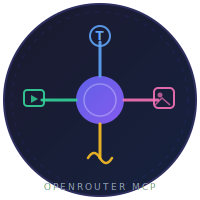

<p align="center">
  
</p>

<h1 align="center">OpenRouter MCP Multimodal</h1>

<p align="center">
  <strong>The MCP server for multimodal AI agents.</strong><br/>
  One install · 14 tools · 300+ OpenRouter models · text, vision, audio &amp; video — analysis and generation.
</p>

<p align="center">
  <a href="https://www.npmjs.com/package/@stabgan/openrouter-mcp-multimodal"></a>
  <a href="https://github.com/stabgan/openrouter-mcp-multimodal/releases"></a>
  <a href="https://hub.docker.com/r/stabgan/openrouter-mcp-multimodal"></a>
  <a href="https://github.com/stabgan/openrouter-mcp-multimodal/actions/workflows/ci.yml"></a>
  <a href="https://www.apache.org/licenses/LICENSE-2.0"></a>
  <a href="https://nodejs.org"></a>
</p>

<p align="center">
  <a href="https://www.npmjs.com/package/@stabgan/openrouter-mcp-multimodal"></a>
  <a href="https://hub.docker.com/r/stabgan/openrouter-mcp-multimodal"></a>
  <a href="https://registry.modelcontextprotocol.io/servers/io.github.stabgan/openrouter-multimodal"></a>
  <a href="https://smithery.ai/server/@stabgan/openrouter-mcp-multimodal"></a>
</p>

<p align="center">
  <a href="#quick-start">Quick start</a> ·
  <a href="#tools">Tools</a> ·
  <a href="#examples">Examples</a> ·
  <a href="#security">Security</a> ·
  <a href="#development">Development</a> ·
  <a href="#faq">FAQ</a>
</p>

---

## What is this?

**OpenRouter MCP Multimodal** is a production-grade [Model Context Protocol (MCP)](https://modelcontextprotocol.io) server — listed on the [official MCP Registry](https://registry.modelcontextprotocol.io/servers/io.github.stabgan/openrouter-multimodal) as `io.github.stabgan/openrouter-multimodal`. It connects AI coding agents ([Cursor](https://cursor.com), [Claude Desktop](https://claude.ai/download), [VS Code](https://code.visualstudio.com), [Windsurf](https://codeium.com/windsurf), [Cline](https://github.com/cline/cline), and others) to [OpenRouter](https://openrouter.ai)'s unified LLM API over stdio.

Unlike text-only MCP servers, one install covers the **full multimodal surface**:

| Capability  | Tools                                                                                   | Highlights                                                                                                   |
| :---------- | :-------------------------------------------------------------------------------------- | :----------------------------------------------------------------------------------------------------------- |
| **Chat**    | `chat_completion`                                                                       | 300+ models, `:nitro` / `:exacto` suffixes, provider routing, web search, response caching, reasoning tokens |
| **Vision**  | `analyze_image`, `generate_image`                                                       | OCR, captioning, VQA, image generation with reference inputs                                                 |
| **Audio**   | `analyze_audio`, `generate_audio`                                                       | Transcription, speech/music generation                                                                       |
| **Video**   | `analyze_video`, `generate_video`, `generate_video_from_image`, `get_video_status`      | Clip understanding, Veo / Sora / Seedance / Wan generation with progress notifications                       |
| **Catalog** | `search_models`, `get_model_info`, `validate_model`, `rerank_documents`, `health_check` | Model discovery, validation, reranking, ops health                                                           |

**Production hardening:** input/output path sandboxes (including analyze\_\* local files as of v4.5.2), SSRF guards, structured errors with `_meta.code`, MCP 2025-06-18 structured outputs, async video progress notifications, and **650+** automated tests (unit, mock, regression, and live integration).

## Quick start

**1. Get an API key** (free tier works) → [openrouter.ai/keys](https://openrouter.ai/keys)

**2. Run the server**

```bash
export OPENROUTER_API_KEY=sk-or-v1-...
npx -y @stabgan/openrouter-mcp-multimodal
```

**3. Add to your MCP client** (Cursor, Claude Desktop, VS Code, etc.) — see [Install](#install) below.

> **No credits required to start.** Free models such as `google/gemma-4-26b-a4b-it:free` work for chat and vision. Video/audio generation typically needs credits.

## Install

MCP servers are distributed through several packaging models. **This server is implemented in Node.js/TypeScript**; the table below maps each ecosystem method to how you run it here.

| Method | Runtime | Best for | This server |
| :--- | :--- | :--- | :--- |
| **[npx](#npx-recommended)** | Node.js 20+ | Most MCP clients (default) | ✅ `@stabgan/openrouter-mcp-multimodal` |
| **[uvx / pipx](#uvx--pipx-python-launcher)** | Python 3.10+ **and** Node.js 20+ | Python-first workflows, same pattern as PyPI MCP servers | ✅ `mcp-server-openrouter-multimodal` |
| **[npm global](#npm-global)** | Node.js 20+ | Pin a version without re-downloading | ✅ |
| **[node (local)](#node-local-clone)** | Node.js 20+ | Contributors / air-gapped builds | ✅ |
| **[Docker Hub](#docker)** | Docker | Isolation, no Node on host | ✅ `stabgan/openrouter-mcp-multimodal` |
| **[GHCR](#ghcr-github-container-registry)** | Docker | GitHub-native OCI pulls | ✅ `ghcr.io/stabgan/openrouter-mcp-multimodal` |
| **[Smithery CLI](#smithery)** | Node.js (via installer) | Interactive install into Claude/Cursor/etc. | ✅ |
| **[MCP Registry](#mcp-registry)** | npm or OCI | Official discovery (`io.github.stabgan/openrouter-multimodal`) | ✅ [listing](https://registry.modelcontextprotocol.io/servers/io.github.stabgan/openrouter-multimodal) |
| **[One-click deeplinks](#one-click)** | Node.js | Cursor, VS Code, Kiro | ✅ |
| **[Claude Code CLI](#claude-code-cli)** | Node.js | Terminal-first Claude Code users | ✅ |
| **[MCP Inspector](#mcp-inspector)** | Node.js | Debug / list tools locally | ✅ |
| **Windows `cmd /c npx`** | Node.js | Claude Desktop / Cursor when `npx` not on GUI PATH | ✅ [see below](#windows-npx) |
| pip / uv (direct) | — | Native Python MCP servers only | — use **uvx** row above |
| DXT desktop extensions | — | Bundled Claude Desktop `.dxt` | not yet |
| Remote HTTP / SSE | — | Hosted Smithery / Cloudflare endpoints | via [Smithery](https://smithery.ai/server/@stabgan/openrouter-mcp-multimodal) |

> **uvx vs npx:** In the MCP ecosystem, **`npx` runs npm (Node) packages** and **`uvx` runs PyPI (Python) packages**. Because this server is Node-based, `uvx` uses a thin [Python launcher](./python/) that execs `npx -y @stabgan/openrouter-mcp-multimodal` — you still need Node installed.

### One-click

<table>
<tr><td><strong>Cursor</strong></td><td><a href="https://cursor.com/en/install-mcp?name=openrouter&config=eyJ0eXBlIjoic3RkaW8iLCJjb21tYW5kIjoibnB4IiwiYXJncyI6WyIteSIsIkBzdGFiZ2FuL29wZW5yb3V0ZXItbWNwLW11bHRpbW9kYWwiXSwiZW52Ijp7Ik9QRU5ST1VURVJfQVBJX0tFWSI6InNrLW9yLXYxLS4uLiJ9fQ%3D%3D"></a></td></tr>
<tr><td><strong>VS Code</strong></td><td><a href="https://insiders.vscode.dev/redirect/mcp/install?name=openrouter&config=%7B%22type%22%3A%22stdio%22%2C%22command%22%3A%22npx%22%2C%22args%22%3A%5B%22-y%22%2C%22%40stabgan%2Fopenrouter-mcp-multimodal%22%5D%2C%22env%22%3A%7B%22OPENROUTER_API_KEY%22%3A%22sk-or-v1-...%22%7D%7D"></a></td></tr>
<tr><td><strong>Kiro</strong></td><td><a href="https://kiro.dev/launch/mcp/add?name=openrouter&config=%7B%22command%22%3A%22npx%22%2C%22args%22%3A%5B%22-y%22%2C%22%40stabgan%2Fopenrouter-mcp-multimodal%22%5D%2C%22env%22%3A%7B%22OPENROUTER_API_KEY%22%3A%22sk-or-v1-...%22%7D%2C%22disabled%22%3Afalse%2C%22autoApprove%22%3A%5B%5D%7D"></a></td></tr>
<tr><td><strong>Claude Desktop / Windsurf / Cline</strong></td><td><a href="#manual-config">Manual JSON config</a> (pick any method below)</td></tr>
<tr><td><strong>Smithery</strong></td><td><a href="https://smithery.ai/server/@stabgan/openrouter-mcp-multimodal"><code>npx -y @smithery/cli install @stabgan/openrouter-mcp-multimodal --client claude</code></a></td></tr>
<tr><td><strong>MCP Registry</strong></td><td><a href="https://registry.modelcontextprotocol.io/servers/io.github.stabgan/openrouter-multimodal">Official registry page</a> — npm + OCI packages</td></tr>
</table>

Paste your `OPENROUTER_API_KEY` when prompted — deeplinks use placeholders so secrets never appear in URLs.

### Manual config

<details open>
<summary><strong>npx (recommended)</strong></summary>

```bash
export OPENROUTER_API_KEY=sk-or-v1-...
npx -y @stabgan/openrouter-mcp-multimodal
```

```json
{
  "mcpServers": {
    "openrouter": {
      "command": "npx",
      "args": ["-y", "@stabgan/openrouter-mcp-multimodal"],
      "env": {
        "OPENROUTER_API_KEY": "sk-or-v1-..."
      }
    }
  }
}
```

Pin a release: `"args": ["-y", "@stabgan/openrouter-mcp-multimodal@4.5.2"]`

</details>

<details>
<summary><strong>uvx / pipx (Python launcher)</strong></summary>

Install [uv](https://docs.astral.sh/uv/getting-started/installation/) (includes `uvx`), ensure **Node.js 20+** is also on your `PATH`, then:

```bash
export OPENROUTER_API_KEY=sk-or-v1-...
uvx mcp-server-openrouter-multimodal
```

```json
{
  "mcpServers": {
    "openrouter": {
      "command": "uvx",
      "args": ["mcp-server-openrouter-multimodal"],
      "env": {
        "OPENROUTER_API_KEY": "sk-or-v1-..."
      }
    }
  }
}
```

**Before PyPI publish** — run from this repo's `python/` subdirectory:

```json
{
  "command": "uvx",
  "args": [
    "--from",
    "git+https://github.com/stabgan/openrouter-mcp-multimodal#subdirectory=python",
    "mcp-server-openrouter-multimodal"
  ],
  "env": { "OPENROUTER_API_KEY": "sk-or-v1-..." }
}
```

**pipx equivalent:** `pipx run mcp-server-openrouter-multimodal` (after PyPI publish).

Optional: `OPENROUTER_MCP_NPM_VERSION=4.5.2` pins the underlying npm package.

</details>

<details>
<summary><strong>npm global</strong></summary>

```bash
npm install -g @stabgan/openrouter-mcp-multimodal
```

```json
{
  "mcpServers": {
    "openrouter": {
      "command": "openrouter-multimodal",
      "env": { "OPENROUTER_API_KEY": "sk-or-v1-..." }
    }
  }
}
```

</details>

<details>
<summary><strong>node (local clone)</strong></summary>

```bash
git clone https://github.com/stabgan/openrouter-mcp-multimodal.git
cd openrouter-mcp-multimodal
npm ci && npm run build
```

```json
{
  "mcpServers": {
    "openrouter": {
      "command": "node",
      "args": ["/absolute/path/to/openrouter-mcp-multimodal/dist/index.js"],
      "env": { "OPENROUTER_API_KEY": "sk-or-v1-..." }
    }
  }
}
```

</details>

<details>
<summary><strong>Docker</strong></summary>

```bash
docker run --rm -i -e OPENROUTER_API_KEY=sk-or-v1-... stabgan/openrouter-mcp-multimodal:latest
```

```json
{
  "mcpServers": {
    "openrouter": {
      "command": "docker",
      "args": [
        "run",
        "--rm",
        "-i",
        "-e",
        "OPENROUTER_API_KEY=sk-or-v1-...",
        "stabgan/openrouter-mcp-multimodal:latest"
      ]
    }
  }
}
```

Use `-i` (interactive stdio). Avoid `-t` (TTY corrupts MCP framing on some hosts).

</details>

<details>
<summary><strong>GHCR (GitHub Container Registry)</strong></summary>

```bash
docker run --rm -i -e OPENROUTER_API_KEY=sk-or-v1-... \
  ghcr.io/stabgan/openrouter-mcp-multimodal:4.5.2
```

```json
{
  "mcpServers": {
    "openrouter": {
      "command": "docker",
      "args": [
        "run", "--rm", "-i",
        "-e", "OPENROUTER_API_KEY=sk-or-v1-...",
        "ghcr.io/stabgan/openrouter-mcp-multimodal:latest"
      ]
    }
  }
}
```

</details>

<details>
<summary><strong>Smithery</strong></summary>

Interactive install (writes config for your client):

```bash
npx -y @smithery/cli install @stabgan/openrouter-mcp-multimodal --client claude
# or: --client cursor | vscode | windsurf | ...
```

Listing: [smithery.ai/server/@stabgan/openrouter-mcp-multimodal](https://smithery.ai/server/@stabgan/openrouter-mcp-multimodal)

</details>

<details>
<summary><strong>MCP Registry</strong></summary>

Official name: `io.github.stabgan/openrouter-multimodal`

- Registry: [registry.modelcontextprotocol.io](https://registry.modelcontextprotocol.io/servers/io.github.stabgan/openrouter-multimodal)
- npm package: `@stabgan/openrouter-mcp-multimodal`
- OCI image: `docker.io/stabgan/openrouter-mcp-multimodal`

Clients that support registry-driven install will offer npm or Docker; otherwise use the JSON blocks above.

</details>

<details>
<summary><strong>Claude Code CLI</strong></summary>

```bash
claude mcp add openrouter -- npx -y @stabgan/openrouter-mcp-multimodal
# project scope:
claude mcp add --scope project openrouter -- npx -y @stabgan/openrouter-mcp-multimodal
```

Set `OPENROUTER_API_KEY` in your shell or client env before starting Claude Code.

</details>

<details>
<summary><strong>MCP Inspector</strong></summary>

Debug tools/list and tool calls against a live OpenRouter key:

```bash
export OPENROUTER_API_KEY=sk-or-v1-...
npx -y @modelcontextprotocol/inspector npx -y @stabgan/openrouter-mcp-multimodal
```

</details>

<details>
<summary><strong>Windows npx</strong></summary>

When Claude Desktop or Cursor cannot find `npx` (GUI apps often miss shell `PATH`), wrap with `cmd`:

```json
{
  "mcpServers": {
    "openrouter": {
      "command": "cmd",
      "args": ["/c", "npx", "-y", "@stabgan/openrouter-mcp-multimodal"],
      "env": { "OPENROUTER_API_KEY": "sk-or-v1-..." }
    }
  }
}
```

If still failing, use the full path from `where npx` as the command.

</details>

## Why this server?

| Capability                           | This server | Typical MCP LLM servers |
| :----------------------------------- | :---------: | :---------------------: |
| Text chat (300+ models)              |     ✅      |           ✅            |
| Image analysis + generation          |     ✅      |         partial         |
| Audio analysis + TTS                 |     ✅      |           ❌            |
| Video analysis + generation          |     ✅      |           ❌            |
| Model search / validate / rerank     |     ✅      |           ❌            |
| Path sandbox + SSRF protection       |     ✅      |          rare           |
| MCP 2025 structured outputs          |     ✅      |          rare           |
| Async video + progress notifications |     ✅      |           ❌            |

## Tools

14 MCP tools. Each description includes **Use when**, **Good/Bad examples**, **Fails when**, and **Works with** so agents pick the right tool and recover from errors.

| Tool                        | Purpose                                                     |
| :-------------------------- | :---------------------------------------------------------- |
| `chat_completion`           | Text chat, web search, provider routing, caching, reasoning |
| `analyze_image`             | Vision — local path, URL, or data URL + `question`          |
| `analyze_audio`             | Transcribe / analyze audio files                            |
| `analyze_video`             | Describe / Q&A over video files                             |
| `generate_image`            | Text-to-image with optional reference images                |
| `generate_audio`            | Text-to-speech / music                                      |
| `generate_video`            | Text-to-video (async, resumable)                            |
| `generate_video_from_image` | Image-to-video (narrower schema)                            |
| `get_video_status`          | Poll / resume video jobs                                    |
| `search_models`             | Paginated model catalog search                              |
| `get_model_info`            | Pricing, context, modalities                                |
| `validate_model`            | Cheap model ID existence check                              |
| `rerank_documents`          | Relevance ranking for RAG                                   |
| `health_check`              | API key + reachability probe                                |

Errors use a closed `_meta.code` taxonomy: `INVALID_INPUT` · `UNSAFE_PATH` · `UPSTREAM_*` · `MODEL_NOT_FOUND` · `JOB_STILL_RUNNING` · and more.

## Examples

### Chat (free model)

```json
{
  "tool": "chat_completion",
  "arguments": {
    "model": "google/gemma-4-26b-a4b-it:free",
    "messages": [{ "role": "user", "content": "Summarize MCP in one sentence." }]
  }
}
```

### Analyze an image

```json
{
  "tool": "analyze_image",
  "arguments": {
    "image_path": "diagram.png",
    "question": "List every label in this diagram."
  }
}
```

> Use `image_path` and `question` — not `image` / `prompt`.

### Search models (vision + free)

```json
{
  "tool": "search_models",
  "arguments": {
    "query": "gemma",
    "capabilities": { "vision": true },
    "limit": 10,
    "offset": 0
  }
}
```

### Generate video (async)

```json
{
  "tool": "generate_video",
  "arguments": {
    "model": "google/veo-3.1",
    "prompt": "Ocean waves at sunrise, cinematic drone shot",
    "duration": 4,
    "save_path": "river.mp4"
  }
}
```

If the job is still running when `max_wait_ms` elapses, the response succeeds with `_meta.code: JOB_STILL_RUNNING` and a `video_id` — call `get_video_status` to resume. **This is not an error.**

More examples: [docs/plans/tool-description-improvement.md](./docs/plans/tool-description-improvement.md)

## Security

- **Input path sandbox** — `analyze_*` and reference images must stay inside `OPENROUTER_INPUT_DIR`
- **Output path sandbox** — `save_path` must stay inside `OPENROUTER_OUTPUT_DIR`
- **SSRF protection** — private/reserved IPs blocked on URL fetches
- **Untrusted content** — analyze outputs tagged `_meta.content_is_untrusted: true`

Override sandboxes only with `OPENROUTER_ALLOW_UNSAFE_PATHS=1` (discouraged).

## Configuration

<details>
<summary><strong>Environment variables</strong></summary>

| Variable                       | Required | Default                               | Description                          |
| :----------------------------- | :------: | :------------------------------------ | :----------------------------------- |
| `OPENROUTER_API_KEY`           | **Yes**  | —                                     | OpenRouter API key                   |
| `OPENROUTER_DEFAULT_MODEL`     |    No    | `nvidia/nemotron-nano-12b-v2-vl:free` | Default when tools omit `model`      |
| `OPENROUTER_INTEGRATION_MODEL` |    No    | `google/gemma-4-26b-a4b-it:free`      | Model used by live integration tests |
| `OPENROUTER_OUTPUT_DIR`        |    No    | `cwd`                                 | Sandbox root for `save_path`         |
| `OPENROUTER_INPUT_DIR`         |    No    | —                                     | Sandbox root for local input files   |
| `OPENROUTER_LOG_LEVEL`         |    No    | `info`                                | `error` / `warn` / `info` / `debug`  |

See [`.env.example`](./.env.example) for the full list (provider routing, image/audio/video limits, caching, video polling).

</details>

## Development

```bash
git clone https://github.com/stabgan/openrouter-mcp-multimodal.git
cd openrouter-mcp-multimodal
npm install
cp .env.example .env   # add OPENROUTER_API_KEY
npm run build
```

### Testing

| Command                    | What it runs                                               |
| :------------------------- | :--------------------------------------------------------- |
| `npm test`                 | **652** unit + mock tests (no API key, &lt;2s)             |
| `npm run test:regression`  | Security + schema regression guards                        |
| `npm run test:integration` | **16** live OpenRouter scenarios (**requires** `.env` key) |
| `npm run test:e2e`         | Full MCP stdio smoke (`scripts/live-e2e.mjs`)              |
| `npm run ci`               | lint + format + build + **all** of the above except e2e    |

**Free models for CI / zero-credit accounts:** integration tests default to `google/gemma-4-26b-a4b-it:free` (override with `OPENROUTER_INTEGRATION_MODEL`). GitHub Actions requires the `OPENROUTER_API_KEY` repository secret.

Mock tests live under `src/__tests__/mock/` and cover handlers, path sandboxes, SSRF blocks, model-cache pagination, tool descriptions, and structured outputs — **330+** additional cases beyond the core suite.

```bash
npm run lint
npm run format:check
```

## FAQ

### Do I need paid OpenRouter credits?

No, to get started. Free models work for chat and vision. Audio/video **generation** usually requires credits; analysis may return `402` on some models — the server surfaces that as a structured error.

### Which MCP clients are supported?

Any MCP-compatible client over stdio: Cursor, Claude Desktop, VS Code Copilot, Windsurf, Cline, Kiro, and custom agents.

### How is this different from calling OpenRouter directly?

This server adds MCP tool schemas, security sandboxes, error taxonomy, model caching, async video polling with progress notifications, and agent-oriented tool descriptions — so LLMs invoke the right capability without custom HTTP glue.

### Where is the security advisory for path traversal?

Fixed in 4.5.2+ — see [GHSA-3q7p-736f-x44v](https://github.com/stabgan/openrouter-mcp-multimodal/security/advisories/GHSA-3q7p-736f-x44v) and `docs/solutions/security-issues/`.

## Compatibility

Works with any MCP client. Protocol: **MCP 2025-06-18**. Node **≥ 20** (Docker image uses Node 22).

## License

Apache 2.0 — see [LICENSE](./LICENSE).

## Contributing

Issues and PRs welcome. For large changes, open an issue first. Run `npm run ci` before submitting.
