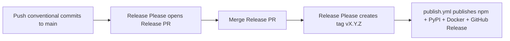

# Releasing

This document explains how versions are bumped, tested, tagged, and published for **OpenRouter MCP Multimodal**. It is written for maintainers, contributors, and AI coding agents working in this repo.

## Distribution channels

Every release must land on **all** of these channels together (same semver):

| Channel | Package / image | Install example |
| :------ | :-------------- | :-------------- |
| **npm** | `@stabgan/openrouter-mcp-multimodal` | `npx -y @stabgan/openrouter-mcp-multimodal@5.0.1` |
| **PyPI** | `mcp-server-openrouter-multimodal` | `uvx mcp-server-openrouter-multimodal` |
| **Docker Hub** | `stabgan/openrouter-mcp-multimodal` | `docker run -i stabgan/openrouter-mcp-multimodal:5.0.1` |
| **GHCR** | `ghcr.io/stabgan/openrouter-mcp-multimodal` | same tag as Docker Hub |
| **GitHub** | git tag `vX.Y.Z` + GitHub Release | source of truth for changelog |

The Python package is a **launcher only** — it runs `npx` against the npm package. Both must stay on the same version.

> **Important:** Pushing to `main` alone does **not** update npm or PyPI. Only a **version tag** (`v*`) triggers publishing. Docker `:latest` is also updated on tag push (not on every main commit).

---

## Normal release flow (recommended)

We use [Release Please](https://github.com/googleapis/release-please) to automate version bumps and changelog entries.



### Step-by-step

1. **Land changes on `main`** using [Conventional Commits](https://www.conventionalcommits.org/):
   - `fix:` → patch bump (4.6.2 → 4.6.3)
   - `feat:` → minor bump (4.6.2 → 4.7.0)
   - `feat!:` or `BREAKING CHANGE:` footer → major bump
   - `chore:`, `docs:`, `refactor:`, `test:` → usually no release until grouped in a Release PR (Release Please still tracks them in the changelog when part of a release)

2. **Wait for the Release Please PR** — workflow: [`.github/workflows/release-please.yml`](../.github/workflows/release-please.yml).  
   The PR title looks like: `chore(main): release 4.6.3`.  
   It bumps version files and updates [`CHANGELOG.md`](../CHANGELOG.md).

3. **Review the Release PR** — confirm version, changelog, and that CI is green.

4. **Merge the Release PR** — Release Please creates git tag `vX.Y.Z` and a GitHub Release.

5. **Verify publish** — workflow: [`.github/workflows/publish.yml`](../.github/workflows/publish.yml) runs on the new tag (npm, PyPI, Docker, and a **GitHub Release** whose body is extracted from [`CHANGELOG.md`](../CHANGELOG.md) via [`scripts/changelog-section.mjs`](../scripts/changelog-section.mjs)):
   ```bash
   npm view @stabgan/openrouter-mcp-multimodal@X.Y.Z version
   curl -s https://pypi.org/pypi/mcp-server-openrouter-multimodal/json | jq -r .info.version
   gh release view vX.Y.Z --json name,isLatest
   # Docker: check hub.docker.com/r/stabgan/openrouter-mcp-multimodal/tags
   gh run list --workflow=publish.yml --limit 3
   ```

6. **Update README pin examples** (if present) to the new version — Release Please does not edit README install snippets automatically.

### Release Please config

| File | Purpose |
| :--- | :------ |
| [`release-please-config.json`](../release-please-config.json) | Bump strategy + extra files |
| [`.release-please-manifest.json`](../.release-please-manifest.json) | Current released version tracker |

Release Please bumps these files in the Release PR:

- `package.json` (+ `package-lock.json` via npm lockfile rules)
- `src/version.ts` (`SERVER_VERSION`)
- `python/pyproject.toml`
- `server.json` (all semver fields + Docker OCI tag)
- `CHANGELOG.md`

---

## Manual release (emergency or first-time)

Use when Release Please is unavailable or you need a one-off release outside the normal PR flow.

### 1. Bump version everywhere

**Source of truth:** `package.json` → `"version"`.

All of these **must match**:

| File | What to update |
| :--- | :------------- |
| `package.json` | `"version"` |
| `package-lock.json` | top-level `"version"` (run `npm install --package-lock-only`) |
| `src/version.ts` | `SERVER_VERSION = 'X.Y.Z'` |
| `python/pyproject.toml` | `version = "X.Y.Z"` |
| `server.json` | top-level `"version"`, each `packages[].version`, and `oci` identifier tag (`docker.io/...:X.Y.Z`) |
| `CHANGELOG.md` | new `## [X.Y.Z] — YYYY-MM-DD` section |
| `.release-please-manifest.json` | `{ ".": "X.Y.Z" }` |
| `README.md` | pin examples (`@5.0.1`, `OPENROUTER_MCP_NPM_VERSION=…`, Docker `:tag`) — optional but recommended |

Verify:

```bash
npm run version:check
```

### 2. Test locally

```bash
npm run ci                    # lint + format + version check + build + unit + regression + integration*
npm run test:smoke:npm        # tarball install + stdio MCP handshake
npm run test:smoke:uvx:local  # Python launcher + local npm pack
# Docker (build + tag + smoke):
docker build -t openrouter-mcp-multimodal:$(node -p "require('./package.json').version")-test .
node scripts/smoke-docker-mcp.mjs
# Python packaging:
cd python && uv build
```

\* Integration tests require `OPENROUTER_API_KEY` in `.env` or the environment. CI runs them via the GitHub secret.

### 3. Commit, tag, push

```bash
git add package.json package-lock.json src/version.ts python/pyproject.toml \
  server.json CHANGELOG.md .release-please-manifest.json README.md
git commit -m "Release vX.Y.Z: short summary."
git tag vX.Y.Z
git push origin main
git push origin vX.Y.Z
```

The **`vX.Y.Z` tag push** triggers `publish.yml` (npm + PyPI + Docker). Do not rely on a main-only push to publish.

### 4. Confirm CI

```bash
gh run watch --exit-status   # pick the Release workflow run for the tag
```

---

## CI workflows

| Workflow | Trigger | Purpose |
| :------- | :------ | :------ |
| [`ci.yml`](../.github/workflows/ci.yml) | PR + push to `main` | Lint, format, **version sync**, build, unit, regression, integration |
| [`release-please.yml`](../.github/workflows/release-please.yml) | push to `main` | Open/update Release PR |
| [`publish.yml`](../.github/workflows/publish.yml) | push tag `v*` or `workflow_dispatch` | Build, publish npm + PyPI + Docker |

### Required GitHub secrets (publish)

| Secret | Used for |
| :----- | :------- |
| `NPMJS_TOKEN` | npm publish |
| `DOCKERHUB_USERNAME` | Docker Hub push |
| `DOCKERHUB_TOKEN` | Docker Hub push |
| `OPENROUTER_API_KEY` | Integration tests in CI |

PyPI no longer uses a repository secret. The `publish-pypi` job authenticates with **Trusted Publishing (OIDC)**. After you complete the one-time PyPI setup below, delete the obsolete `PYPI_API_TOKEN` secret from GitHub repo settings.

### PyPI Trusted Publishing (required one-time setup)

> **⚠️ Register the trusted publisher on PyPI before pushing tag `v5.0.0`.** The `publish-pypi` job authenticates with OIDC only — if the publisher is not registered yet, the v5.0.0 release will fail mid-publish with a trusted-publisher / OIDC error. Complete the steps below **before** the tag lands.

> **Every tagged release after the switch to OIDC will fail on `publish-pypi` with an OIDC / trusted-publisher error until this is configured on PyPI.**

The workflow job `publish-pypi` in [`.github/workflows/publish.yml`](../.github/workflows/publish.yml) requests `id-token: write` and calls `pypa/gh-action-pypi-publish` **without** a password or API token. PyPI verifies the GitHub OIDC identity against a trusted publisher you register once.

1. Sign in to [pypi.org](https://pypi.org) as a maintainer of **`mcp-server-openrouter-multimodal`**.
2. Open **Your projects** → **mcp-server-openrouter-multimodal** → **Publishing** (or **Manage** → **Publishing**).
3. Under **Trusted publishers**, choose **Add a new pending publisher** (or **Add GitHub publisher**).
4. Fill in exactly:

   | Field | Value |
   | :---- | :---- |
   | **PyPI project name** | `mcp-server-openrouter-multimodal` |
   | **Owner** | `stabgan` |
   | **Repository name** | `openrouter-mcp-multimodal` |
   | **Workflow name** | `publish.yml` |
   | **Environment name** | *(leave blank — this workflow does not use a GitHub Environment)* |

5. Save the publisher.

6. **Optional cleanup:** remove the `PYPI_API_TOKEN` repository secret from GitHub (**Settings** → **Secrets and variables** → **Actions**) — it is no longer referenced.

With trusted publishing enabled, `gh-action-pypi-publish` uploads **PEP 740 attestations** by default (they were ignored when publishing with a long-lived API token).

To smoke-test before a real release, register a separate trusted publisher on [test.pypi.org](https://test.pypi.org) pointing at the same workflow, add a temporary job with `repository-url: https://test.pypi.org/legacy/`, and publish a dev version there.

---

## Version sync guard

[`scripts/check-version-sync.mjs`](../scripts/check-version-sync.mjs) fails CI when any tracked file disagrees with `package.json`.

```bash
npm run version:check
```

If you add a new file that embeds the semver, update **both** the script and [`release-please-config.json`](../release-please-config.json) `extra-files`.

---

## What **not** to do

- **Do not** expect `git push origin main` to update npm/PyPI — it won't.
- **Do not** republish an existing npm version — bump patch instead.
- **Do not** tag without running `npm run version:check`.
- **Do not** bump only `package.json` — PyPI, Docker registry metadata, MCP `server.json`, and the MCP handshake version will drift.
- **Do not** auto-increment on every commit to main — that creates noisy releases and breaks semver; Release Please groups changes intentionally.

---

## Checklist (copy for agents)

```
[ ] Conventional commits on main (or manual bump all version files)
[ ] CHANGELOG.md entry for X.Y.Z
[ ] npm run version:check
[ ] npm run ci (or equivalent: lint, build, unit, regression)
[ ] npm run test:smoke:npm && npm run test:smoke:uvx:local
[ ] Docker smoke (optional locally; publish.yml builds multi-arch on tag)
[ ] Merge Release PR OR commit + tag vX.Y.Z + push tag
[ ] Verify npm / PyPI / Docker tags
[ ] Update README pin examples if needed
```

---

## Related docs

- [`CHANGELOG.md`](../CHANGELOG.md) — user-facing release notes
- [`AGENTS.md`](../AGENTS.md) — quick reference for AI agents in this repo
- [`README.md`](../README.md#development) — local dev and test commands
